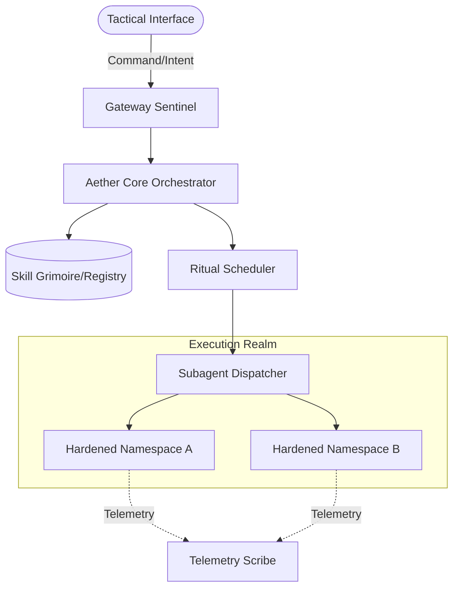
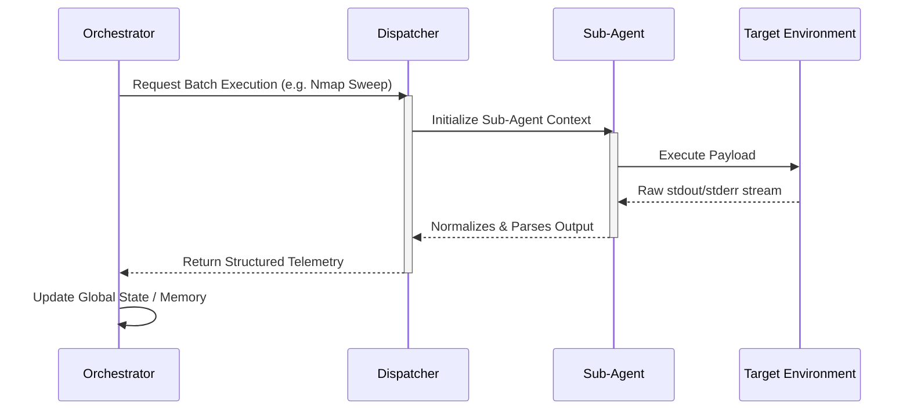
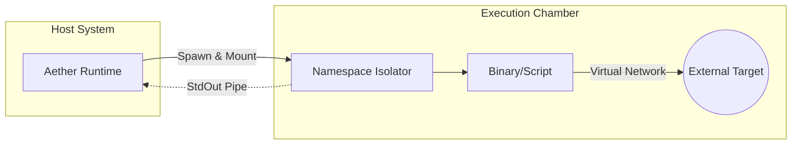

# AETHER HACKER AGENT

**Aether Hacker Agent** is a cutting-edge, autonomous cybersecurity infrastructure orchestrator. Inspired by ancient divine architecture, it provides an agentic runtime for executing, managing, and chaining complex security payloads within isolated, hardened namespaces. 

Aether serves as the connective tissue between high-level tactical intent and low-level system execution.

---

## Technical Architecture

The Aether framework relies on a decoupled, asynchronous processing model to ensure zero-context execution for heavy security workflows.

### 1. Core System Orchestration
The Aether Core manages payload resolution, dependency injection, and state tracking. It acts as the central router for all inbound commands.



### 2. Sub-Agent Dispatch Flow
To handle complex, multi-stage attacks or extensive reconnaissance without blocking the main event loop, Aether utilizes lightweight sub-agents. These sub-agents run parallel execution pipelines.



### 3. Namespace Isolation & Execution Chamber
All untrusted or highly volatile tools (like external exploit scripts or heavy scanners) are executed within transient, isolated sandbox environments.



## Repository Structure

```
aetherhackeragent/
├── engine/              # Core execution loops and state management
├── infrastructure/      # Networking, protocols, and telemetry pipelines
├── intelligence/        # LLM parsing, logic synthesis, and memory
├── security/            # Access control, encryption, and namespace isolation
├── src/                 # Next.js 15 Frontend (App Router, Tailwind v4)
└── src/lib/skills.json  # The "Grimoire" - SSOT for available capabilities
```

## Deployment 

```bash
# Clone the repository
git clone https://github.com/your-org/aetherhackeragent.git
cd aetherhackeragent

# Install dependencies
npm install

# Initialize the development server
npm run dev
```

*Requires Node.js 20+ and a compatible package manager.*

---
*© 2026 Divine Protocols. Licensed under MIT.*